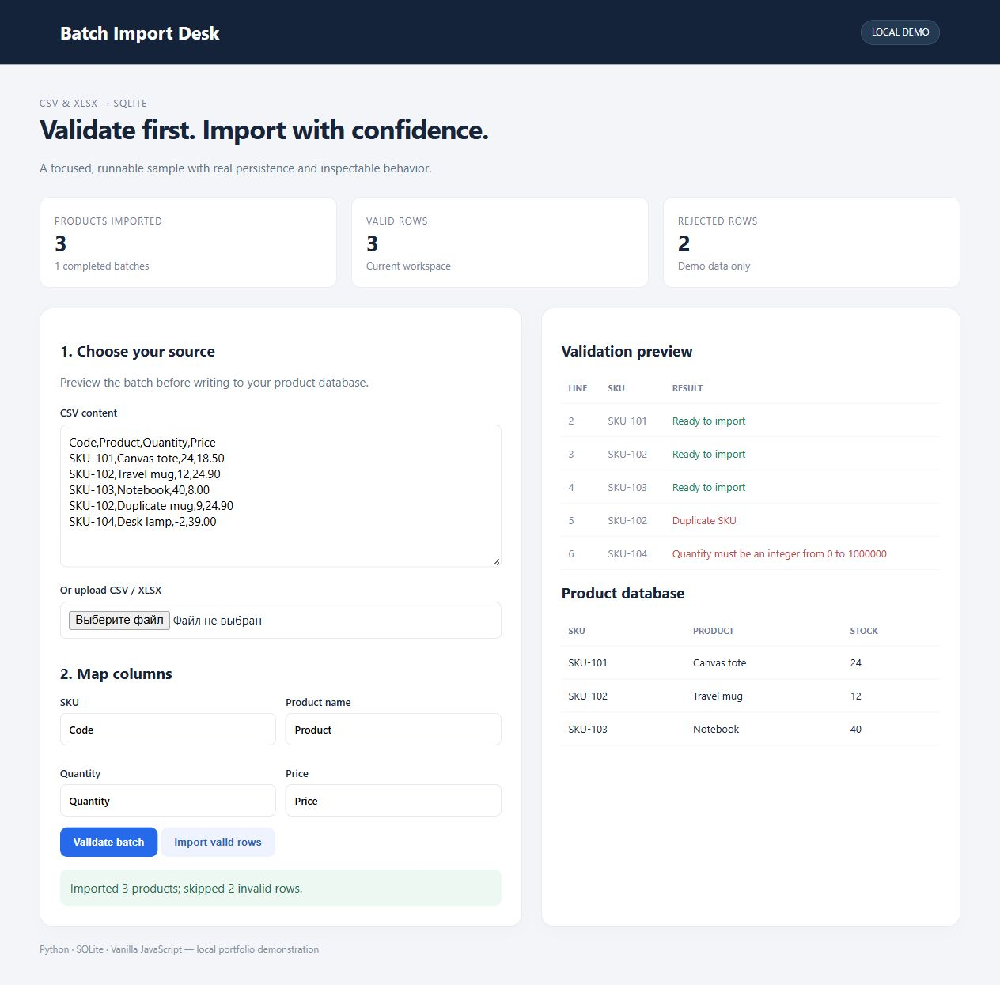

# Batch Import Desk

Validate first. Import with confidence. CSV & XLSX → SQLite.



## Run locally

Python 3.12 or newer:

```sh
python -m venv .venv
# Windows: .venv\Scripts\activate
# Linux/macOS: source .venv/bin/activate
python -m pip install -r requirements.txt
python server.py
```

Open http://127.0.0.1:8765. Set `PORT` to use a different port.

## Tests

```sh
python -m unittest discover -s tests -v
```

## Structure

- `engine.py`: application rules and SQLite persistence.
- `server.py`: local HTTP adapter, bounded JSON requests and origin checks.
- `index.html`: responsive interface; untrusted text is escaped before rendering.
- `tests/`: behavior tests using temporary databases.

## Scope

This is a local, single-user portfolio demonstration. It binds to loopback and has no public account system. Do not expose it directly to the internet. Authentication, access isolation, quotas, monitoring and deployment hardening are separate work. Secrets and local databases are excluded from Git.

## Import behavior

Use the bundled five-row CSV to see three valid products, one duplicate and one invalid quantity. Map columns, validate, then import valid rows. Invalid rows are skipped explicitly. All valid rows and the batch receipt commit in one transaction. Repeating an identical request returns the stored receipt without additional writes. Changed source/mapping is a different batch; existing SKUs are rejected. CSV and XLSX are limited to 1000 rows. Prices use decimal arithmetic.
